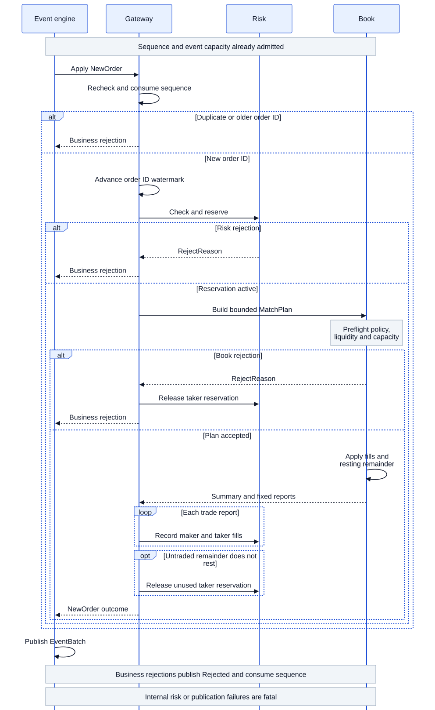

# deterministic-exchange-rs

[](https://github.com/Ninian-Lemain/deterministic-exchange-rs/actions/workflows/ci.yml)
[](LICENSE-MIT)
[](https://www.rust-lang.org/)

A high-speed backend server for an electronic financial exchange: a
deterministic, allocation-free Rust matching engine and execution gateway,
built for learning and experimentation. One packet flow runs end to end:
RX frame lease -> lifetime-bound binary parsing -> instrument routing ->
per-instrument sequencing -> indexed pre-trade risk -> price-time
matching/cancel -> execution reports -> replay digest.

Current version: **v0.19.0**. The v0.13 dedicated Linux qualification still
needs hardware. The project is under active development and is not production
ready. It implements exchange-infrastructure mechanics by hand:
deterministic state transitions, fixed memory layouts, conservative
pre-trade risk, explicit backpressure, price-time priority, session
sequencing, replayability, and cache-aware cross-core handoff. Every piece
is held to testable ownership, capacity, and failure invariants. The
[roadmap](docs/ROADMAP.md) tracks the remaining correctness, verification,
and operational milestones toward v1. Nothing here replaces venue
certification, proprietary feed handlers, or measured kernel-bypass
deployment work.

## Design Rules

- The parser borrows the RX frame; a normalized order crosses cores as one
  bounded copy into a preallocated SPSC slot. No hidden allocation anywhere
  in between.
- Fixed capacities reject explicitly. A full book, risk table, or queue
  returns an error and mutates nothing; nothing silently overwrites live
  state.
- One writer per book. An instrument shard owns its risk state and order
  book, so the hot path takes no locks.
- Integer prices and quantities. No logging, formatting, syscalls, or
  allocation in the measured packet-to-report path.
- Unsafe is confined to three documented sites: SPSC slot access, the FFI
  wrapper, and the benchmark counting allocator.
- Strict inbound sequencing, owner-authorized cancel, partial-fill
  reservation accounting, fail-closed capacity behavior.

## Build, Test, Benchmark

Requirements: Rust 1.85 or newer (see `rust-toolchain.toml`), with `rustfmt`
and Clippy. The engine itself builds on stable Rust with no third-party
dependencies.

```console
cargo build --workspace --release
cargo test --workspace --all-features
cargo run --release -p hft-cli -- replay-demo
cargo run --release -p hft-bench
```

The benchmark executable exits nonzero if the measured hot path allocates or
deallocates after warm-up. See [QUICKSTART.md](QUICKSTART.md) for all quality
gates (fmt, Clippy with warnings denied, Loom, fuzz smoke, source ratio).

Supported platforms: the engine is portable safe Rust, tested on Windows and
Linux x86_64. Linux is the reference platform for latency qualification;
Windows/macOS timing results are correctness and regression evidence only,
never production-latency claims.

## Memory Layout and Cache Behavior

The latency numbers below are mostly a product of data layout:

- Every hot-path structure is a fixed-capacity flat array sized at compile
  time: accounts, reservations, orders, price levels, reports, queue slots.
  Memory is reserved at init; nothing grows, rehashes, or fragments
  mid-session.
- Orders inside a price level form an intrusive doubly linked FIFO over
  stable slot indices. Fills and cancels rewrite two links in place; peer
  orders never move, so a slot handle stays valid for the life of the order.
- A per-side sorted-level index gives O(1) best-price discovery and O(log n)
  price lookup. Creating or removing a level shifts O(n) compact index entries,
  not the orders stored in those levels.
- An open-addressed `OrderId -> slot` index at bounded load makes cancel
  lookup expected O(1). Each index entry occupies 16 bytes on x86_64.
- The SPSC handoff pads head and tail positions onto separate cache lines so
  producer and consumer never false-share. A slot is published with Release
  and observed with Acquire; thread-private cached positions need no atomics
  at all.
- The gateway event loop is single-threaded per shard: one input queue in,
  one report stream out, no wall-clock reads, no thread-timing dependence in
  any state transition.

## Performance Goals

- Zero measured heap allocation or deallocation on the declared hot paths
  (parsing, sequencing, risk, matching, reports, SPSC handoff) after
  initialization.
- O(1)-with-respect-to-book-shape identity lookups at bounded load factors.
- O(log levels) price lookup, O(1) best-price discovery.
- Flat per-operation latency independent of FIFO depth.
- Single-traversal matching: one plan walk, one mutation walk, one report
  per fill, preflighted capacity so rejection mutates nothing.

Current desktop-smoke evidence (Intel N95, Windows 11, Rust 1.96.0, fat LTO;
methodology and raw tables in [docs/PERFORMANCE.md](docs/PERFORMANCE.md)). All
scenarios warm up before sampling, hold their fixtures in steady state, and
report sorted percentiles, so single scheduler preemptions cannot dominate
the headline numbers:

| Workload | p50 | p99.9 | Mean |
| --- | ---: | ---: | ---: |
| Gateway packet-to-report, 200,000 messages | 300 ns | 400 ns | 194 ns/msg |
| Indexed cancel, 512-level book | n/a | n/a | 63-90 ns/cancel |
| Risk check / fill / cancel / settle, 90% occupancy | 100-200 ns | 200-300 ns | 125-144 ns |
| Best-price discovery, 120 active levels | 100 ns | 200 ns | 110 ns |
| Match-plan submit (non-crossing to 8-fill) | 200 ns | 300-900 ns | 206-314 ns |

These are noisy desktop numbers with timer overhead included; the reported
maximum still captures occasional OS preemption and is kept visible rather
than trimmed. They validate the allocation discipline and catch regressions;
they are not Linux/NIC production-latency evidence.

## Determinism

Identical input and initial state produce identical logical output. The
enforcing rules: fixed-capacity arrays instead of hash maps with random
iteration order, one writer per book, no wall-clock or thread-timing
dependence in state transitions, canonical big-endian digest lanes, and a
golden replay digest (`hft-replay`) that every change must keep stable.
Generated-command tests use seeded, reproducible generators.

## Safety Policy

Safe Rust is the default. Domain logic, parsing, risk, matching, gateway
coordination, and replay forbid unsafe code (`#![forbid(unsafe_code)]`).
Repository-owned unsafe sits at three documented sites: SPSC slot access
(Release/Acquire publication, Loom-modelled), the optional vendor C ABI
wrapper (opaque handles, fixed-width types, explicit ownership and error
codes), and the benchmark counting allocator. Default builds are Rust-only;
the optional C test shim builds behind `--features vendor-sdk` and is covered
by ABI tests plus ASan/UBSan in CI. See [docs/SAFETY.md](docs/SAFETY.md) for
the full inventory and native-boundary policy.

## Verification Evidence

| Gate | Evidence |
| --- | --- |
| Workspace correctness | Formatting, all-target check, Clippy with warnings denied, unit/integration/doc tests |
| Parser validation | Boundary cases, malformed-input smoke, and a `cargo-fuzz` target |
| Concurrency | Cross-thread FIFO stress test and Loom Release/Acquire model |
| Memory safety | Miri on parser/risk/book and AddressSanitizer on the FFI crate |
| Hot-path allocation | Post-warm-up counter asserts zero allocation and deallocation deltas |
| Replay stability | Golden final-state digest with canonical byte-order encoding |
| Language boundary | Rust source-ratio gate and an allowlist for crates containing unsafe code |

## Architecture

| Crate | Responsibility | Hot-path allocation |
| --- | --- | --- |
| `hft-types` | Fixed-width domain types and reports | None |
| `hft-wire` | Validated lifetime-bound parsing | None |
| `hft-io` | RAII frame leases, in-memory and UDP baseline | Preallocated frame |
| `hft-spsc` | Bounded cache-aware SPSC handoff | None after construction |
| `hft-risk` | Fixed-capacity limits, indexed accounts and reservations | None |
| `hft-book` | Price-time matching: stable-slot FIFO levels, sorted-level indices, `OrderId` index, match plans | None |
| `hft-gateway` | Transaction coordination and report accounting | None |
| `hft-events` | Sequenced command event batches and bounded SPSC publication | None after construction |
| `hft-engine` | Single-instrument admission, journal status, shutdown, and snapshot boundary | None in measured admission |
| `hft-router` | Fixed instrument routes, shard command queues, and shard event queues | None after construction |
| `hft-replay` | Ordered replay and stable final-state digest | None in engine |
| `hft-recovery` | Canonical snapshots, SHA-256 verification, and journal tail restore | Cold path |
| `hft-ffi` | Optional vendor C ABI ownership wrapper | Vendor-defined |
| `hft-bench` | Allocation assertion and timing smoke harness | Zero measured delta |
| `hft-cli` | Cold-path operational entry point | Out of scope |

Each instrument group runs as a single matching shard. If a packet crosses
cores, the supported design is normalization once into a fixed-size SPSC
slot: a bounded single-copy handoff, not end-to-end zero-copy.

Matching internals: each side of the book keeps price levels in a
fixed-capacity array. A per-side sorted-level index (binary search plus a
free-slot pool) provides O(1) best-price discovery and O(log n) price lookup.
Level insertion and removal shift O(n) index entries. Inside a level, orders
live in an intrusive doubly linked FIFO with stable slot handles, so fills and
cancels never shift peer orders. An open-addressed `OrderId -> slot` index makes
cancel/lookup expected O(1).
`submit` builds a bounded `MatchPlan` in one traversal (preflighting every
capacity and validity condition), then applies it infallibly: a rejected
order mutates nothing, and no rollback machinery exists to drift out of
sync.

## Workflow Diagrams

### Packet-to-Report Data Path

[](docs/diagrams/packet-to-report.mmd)

The parser borrows the RX frame. Only the optional cross-core handoff copies
a normalized fixed-size order into a preallocated queue slot.

### New-Order Transaction

[](docs/diagrams/new-order-transaction.mmd)

Both SVG images are generated from the linked, version-controlled Mermaid
sources so architectural changes remain reviewable.

## What I Learned

Building the whole path end to end taught more about systems Rust than any
single subsystem did. The full write-up is in
[What I Learned](docs/LEARNINGS.md); the short version:

- **Zero allocation is a layout decision.** The hot path
  stays allocation-free because every structure it touches was sized at
  compile time and allocated at init. Once the arenas exist there is no
  `Vec::push` left to slip in, and the release-mode counting allocator turns
  any regression into a failed process exit.
- **Lifetimes can replace runtime coordination.** `FrameLease` ties parser
  borrows to the RX buffer's lifetime, so "don't recycle a frame while it is
  borrowed" is a compile error instead of a protocol comment.
- **Cache locality is decided by layout.** Padding SPSC head/tail
  onto separate cache lines, keeping orders in flat arrays with stable slot
  handles, and routing best-price through a sorted index are what make the
  measured latencies flat. The algorithms themselves are ordinary.
- **Preflight everything, then apply infallibly.** Every fallible condition
  of a match (validation, duplicates, report capacity, level capacity) is
  decidable before the first mutation. That deleted the entire rollback path
  and the class of restore-the-world bugs that came with it.
- **A deterministic event loop is mostly about what you exclude.** One
  writer per book, no wall-clock reads, no hash-map iteration order, seeded
  generators. Most of determinism came from removing sources of variation.
- **Release/Acquire pairs are ownership proofs.** The SPSC queue publishes a
  slot with Release and observes it with Acquire; the same pairing protects
  reclamation in the other direction. A Loom model checks the publication
  invariant so the reasoning does not rest on code review alone.
- **Benchmarks lie quietly.** Early harnesses "measured" cancels against
  already-closed IDs and crossing scenarios that had run out of makers.
  Every timed operation now carries an assertion that it did real work, runs
  after warm-up against a steady-state fixture, and reports sorted
  percentiles.
- **Fail closed or don't check at all.** Defensive `Option` returns for
  impossible states hid two paths that mutated before erroring. Internal
  invariants are now `debug_assert`/`expect` with the invariant named; stale
  external handles reject before any mutation.
- **Honest scope beats impressive scope.** No venue certification, no
  snapshot rotation policy, no kernel bypass. Naming those as roadmap items keeps
  the slice that does exist verifiable.

## Capability Matrix

| Capability | State | Evidence / limitation |
| --- | --- | --- |
| Borrowed binary parser | Implemented | Boundary and malformed-input tests |
| New/cancel wire messages | Implemented | Fixed lengths and big-endian scalar fields |
| RAII RX lease | Implemented | In-memory and UDP buffer ownership |
| Fixed-capacity risk | Implemented | Quantity, notional, position, open-order, collar, duplicate, kill checks |
| Indexed risk state | Implemented | O(1) account/reservation lookup at bounded load; occupancy benchmark |
| Price-time book | Implemented | Stable-slot FIFO levels; fills/cancels never shift peers |
| Sorted-level discovery | Implemented | O(1) best price; binary-search level maintenance; slot reuse |
| Matching transaction plan | Implemented | Single plan traversal; preflighted atomic rejection; no rollback path |
| Deterministic replay | Implemented | Stable final-state digest test |
| Snapshot and journal recovery | Implemented | Canonical v1 fixture, SHA-256 verification, full replay equivalence |
| Bounded command events | Implemented | Atomic command batches, stable order, explicit pre-mutation backpressure |
| Multi-instrument routing | Implemented | Fixed routes, one writer per shard, bounded command and event queues |
| Session sequence enforcement | Implemented | Duplicates/gaps fail closed without advancing |
| Owner-authorized cancel | Implemented | FIFO-preserving removal and exact risk release |
| Cache-aware SPSC | Implemented | Release/Acquire docs, stress test, Loom model |
| Allocation audit | Implemented | Release executable asserts zero measured deltas |
| UDP baseline | Implemented | Syscall path; not a latency claim |
| AF_XDP backend | Planned | Feature-gated availability marker only |
| Vendor SDK | Planned | Safe wrapper exists; no proprietary SDK linked |
| Hardware perf counters | Planned | Requires Linux/perf and a dedicated runner |

## Current Limitations

- No external venue traffic, automatic snapshot rotation, snapshot manifest,
  authentication, or venue-certified session protocol is implemented.
- Routing uses one instrument per shard and per-instrument sequence domains.
  Dynamic reassignment and a merged cross-shard event order are not provided.
- Order IDs are monotonically increasing per gateway session. Reuse and
  out-of-order IDs fail closed.
- The book rejects when report, order, per-price FIFO, or price-level
  capacity would be exceeded; capacity is selected at compile time.
- Identity lookup is expected O(1) at the index's bounded live load; probe
  lengths still grow with clustering near maximum occupancy.
- Timing output includes measurement overhead and desktop scheduler noise.
  See [docs/PERFORMANCE.md](docs/PERFORMANCE.md).
- See [docs/SAFETY.md](docs/SAFETY.md) for every unsafe boundary and
  [docs/ARCHITECTURE.md](docs/ARCHITECTURE.md) for ownership.

## Review Path

For a focused engineering review:

1. `hft-wire`: borrowed validation and protocol boundaries.
2. `hft-risk`: conservative exposure and deterministic rejection order.
3. `hft-book`: price-time matching, plan preflight, and stable-slot levels.
4. `hft-gateway`: sequence enforcement and risk/book lifecycle coordination.
5. `hft-events`: command event ordering and pre-mutation backpressure.
6. `hft-router`: fixed route lookup, shard ownership, and queue backpressure.
7. `hft-spsc`: documented Release/Acquire ownership transfer.
8. `hft-bench`: measured allocation assertion and reproducibility limitations.

The protocol is specified in [docs/PROTOCOL.md](docs/PROTOCOL.md); operational
failure behavior is in [docs/OPERATIONS.md](docs/OPERATIONS.md).

## Project

- [Review](docs/REVIEW.md)
- [What I learned](docs/LEARNINGS.md)
- [Roadmap](docs/ROADMAP.md)
- [Contributing](CONTRIBUTING.md)
- [Security](SECURITY.md)
- [Changes](CHANGES.md)

Licensed under the [MIT License](LICENSE-MIT).
